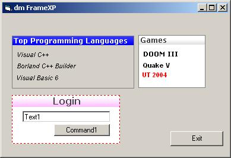



## DM FrameXP

### Description

Hi this is a small Frame control I made about 30 min ago. anyway I sure other people have uploaded there own but here is mine. anyway You can move the frames around. Add captions, Chnage border colors and more. uses No pictures boxes or lables Pure VB code o and only Three API calls that just allow you to move the control and get RGB Value. anyway hope you like it do as you please with the code. Please vote if you like this code.
 
### More Info
 

             |
---                |---
**Submitted On**   |2005-02-17 08:27:04
**By**             |[dreamvb](https://github.com/Planet-Source-Code/PSCIndex/blob/master/ByAuthor/dreamvb.md)
**Level**          |Beginner
**User Rating**    |4.8 (77 globes from 16 users)
**Compatibility**  |VB 4\.0 \(16\-bit\), VB 4\.0 \(32\-bit\), VB 5\.0, VB 6\.0
**Category**       |[Custom Controls/ Forms/  Menus](https://github.com/Planet-Source-Code/PSCIndex/blob/master/ByCategory/custom-controls-forms-menus__1-4.md)
**World**          |[Visual Basic](https://github.com/Planet-Source-Code/PSCIndex/blob/master/ByWorld/visual-basic.md)
**Archive File**   |[DM\_FrameXP1853922172005\.zip](https://github.com/Planet-Source-Code/dreamvb-dm-framexp__1-58966/archive/master.zip)

